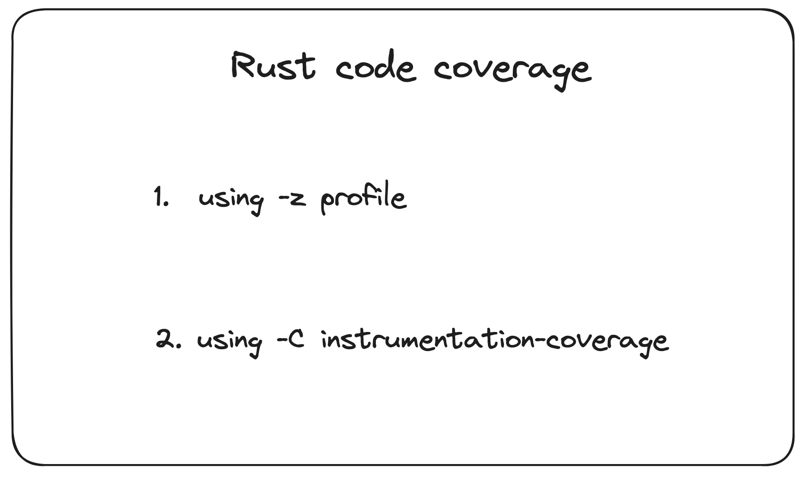

+++
title = "Code Coverage flags in Rust"
template = "page.html"
date = 2024-02-03T03:25:45+05:30
[taxonomies]
tags = ["rust", "code coverage", "rustflags"]
[extra]
summary = "Micro-blog on code coverage flags in Rust"
+++

## Getting code coverage data for Rust projects

Rust provides 2 different flags to collect code coverage data

1. Using -Z profile

2. Using -C instrument-coverage

### Using -Z profile:

This uses the gcc-compatible gcov based coverage implementation. It helps in collecting coverage data based on DebugInfo. This is very useful when we want to see which parts of your code are being executed and which aren’t. This flag cannot be used when compiling incrementally.

## Using -C instrument-coverage:

This flag enables LLVM’s native coverage instrumentation, which is known for its efficiency and precision. It provides highly accurate coverage data, which checks for the exact parts of code that is being executed. This can be very useful for identifying areas of your code that aren’t being tested. So, when you’re looking to improve the robustness of your tests, you can go for `-C instrument-coverage` based coverage tools.
